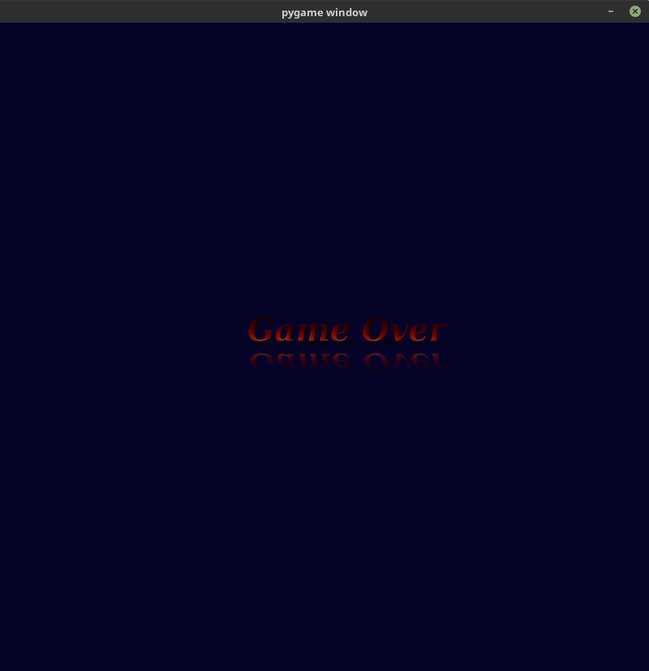

# Crazyvaders
Space Invaders like, Python based game

## Windows

For Python guys running windows, I've written a help
document. You can find it here:  [Windows Python guys](https://github.com/cscortes/crazyvaders/blob/master/docs/Windows_developers.md)

## Purpose
The purpose was to pass the time, and brush up on my Python coding techniques. 
Then my daughter got involved and is pushing me to finish the game. 

In my first pass, I never really gave much consideration to efficiency 
so the first few versions may run slower than expected (at least on your machine).

Again, coding for fun, not profit.

## Alpha Version

I created 5 waves, the last 2 are hard to play.

## Initial Version

Just 1 screen, and a game over screen.

